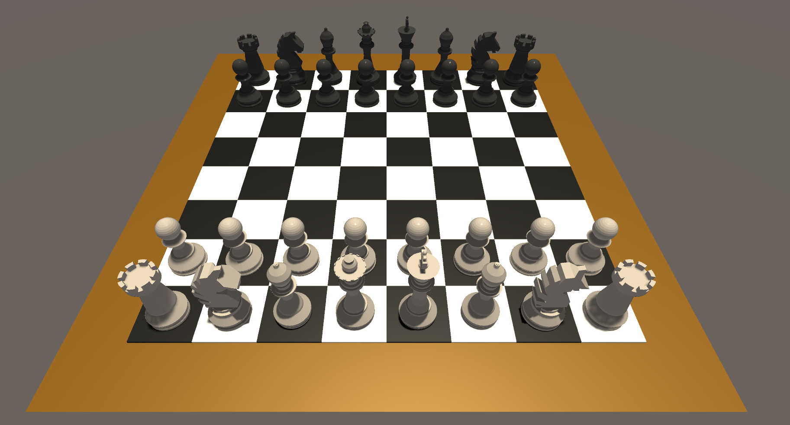
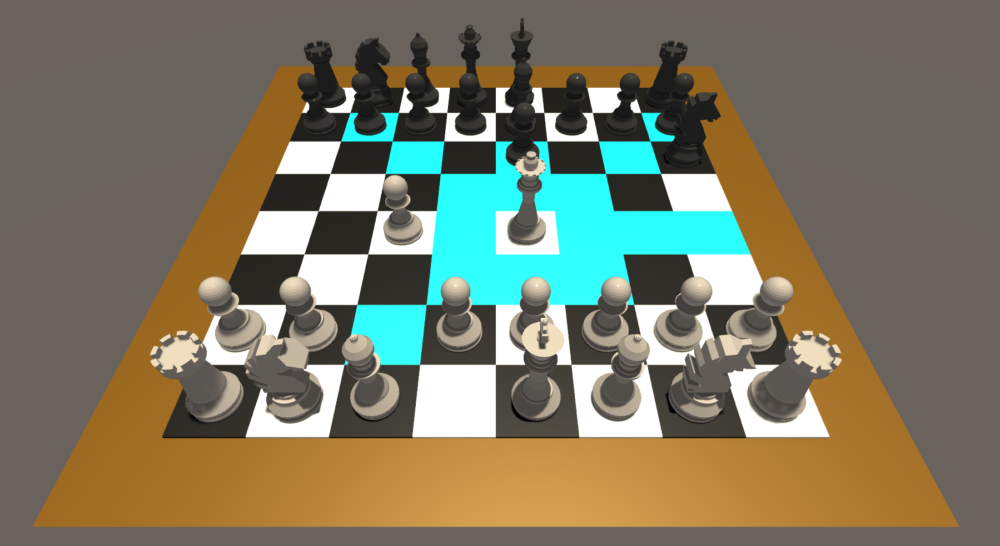
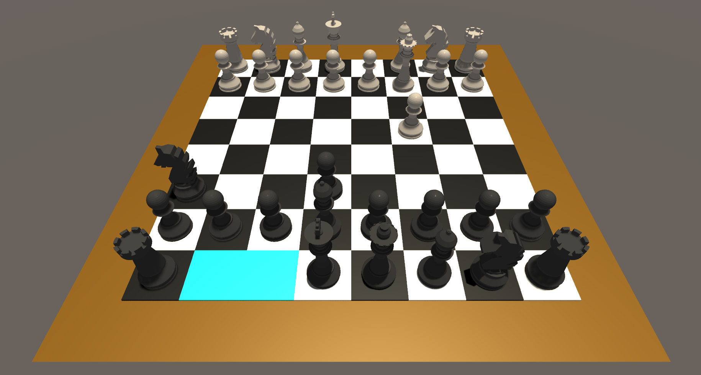
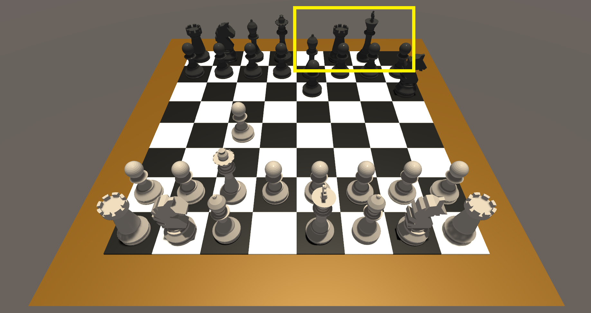

# Chess-Unity3D

Traditional chess game developed with Unity3D

**3D models outsourced**

Demo available

Modes: Traditional

Currently supports: local multiplayer (2 players)

To do: 

    En Passant - done

    Castling - done
       
    Promotion
       
    Checkmate - done
       
    HUD (exit, undo, etc.) - WIP
    
    Possible future implementations:
        
        - antichess mode
        
        - sandbox mode
        
        - online multiplayer

## Change Log

v0.8

- added exit button

- added checkmate detection

---

v0.7

- first demo uploaded

- scripts uploaded

## Screenshots

Game start:

---

UI displaying valid moves:

---

Before/after castling (black king side castle):

